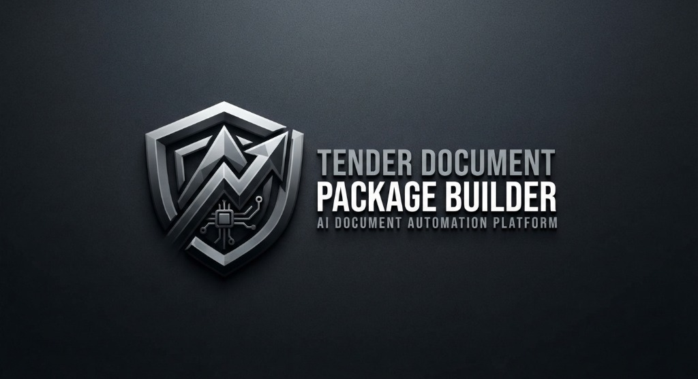
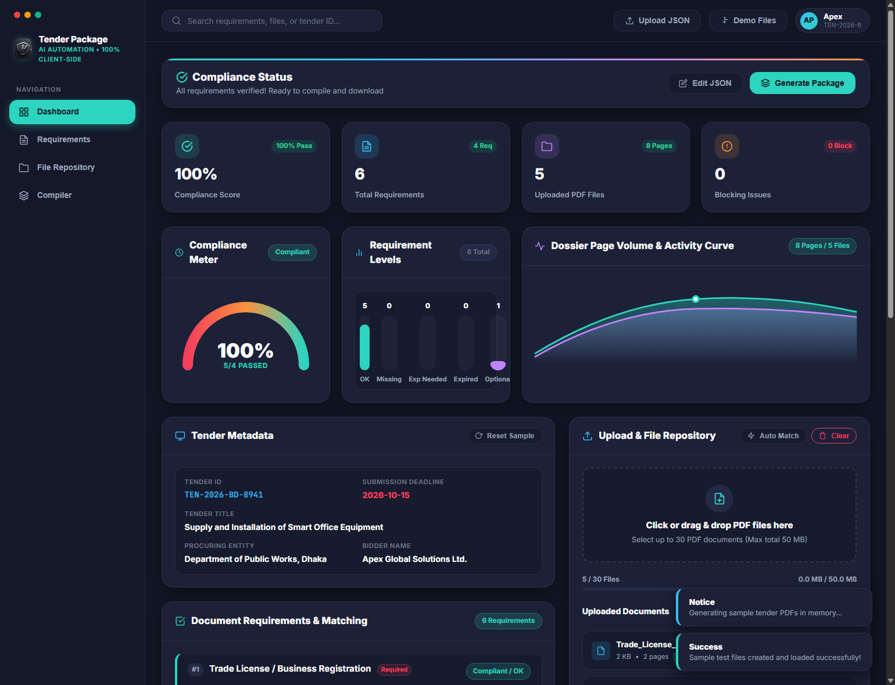
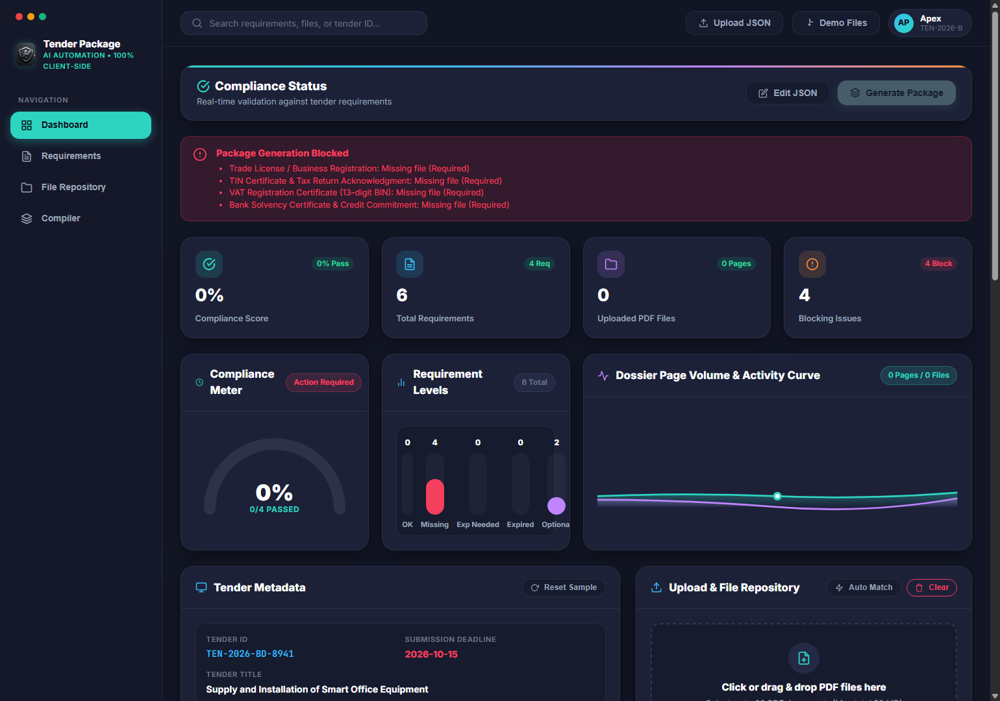
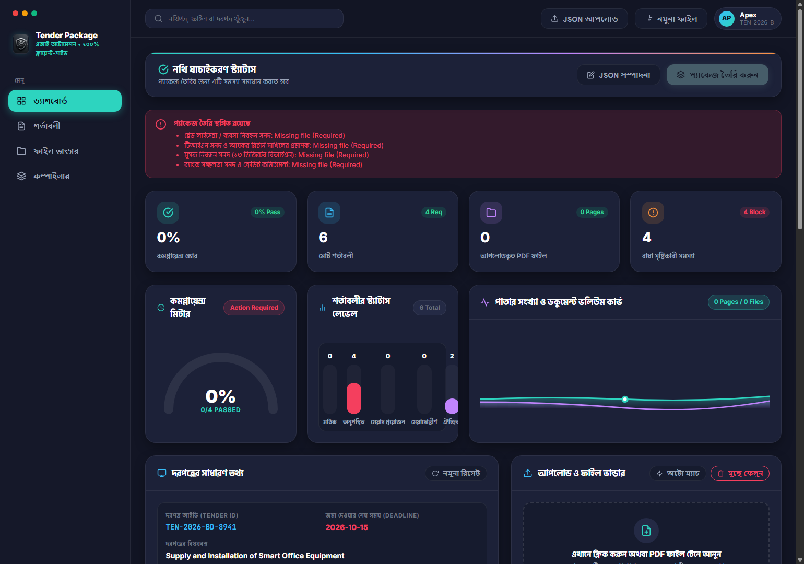
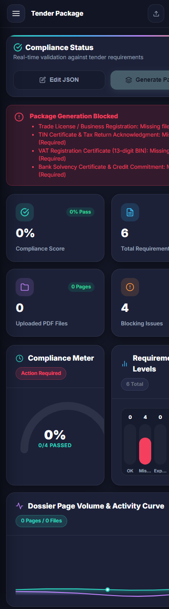
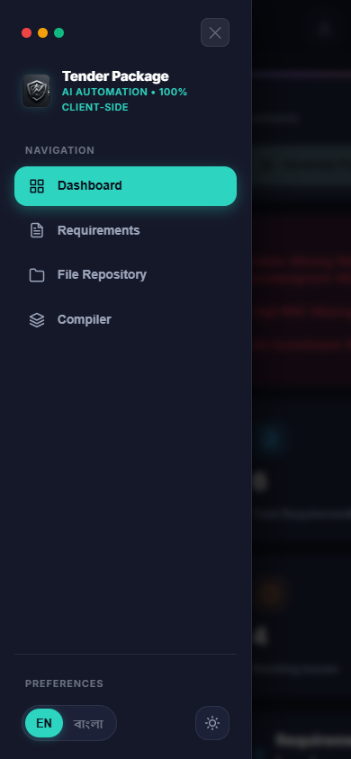

# Tender Document Package Builder



[](https://ahanafanower70-hash.github.io/tender-document-package-builder/)
[](LICENSE)

**🌐 Live Web Application:** [https://ahanafanower70-hash.github.io/tender-document-package-builder/](https://ahanafanower70-hash.github.io/tender-document-package-builder/)


> **AI Document Automation Platform • Executive SaaS Dashboard • 100% Client-Side**  
> An enterprise-grade, browser-based tender document package compiler designed with an executive SaaS dark theme, live interactive SVG diagrams, real-time requirement validation, expiry checking, duplicate detection, and automated single-file PDF package compilation with branded cover pages and uniform page stamps.

---

## 🌟 Interactive Dashboards & Live Working Diagrams

### 1. Compliant & Ready to Compile (100% Passed)

*Featuring the complete executive SaaS layout: Left navigation sidebar with macOS window controls, Mint/Teal active tab pill, Top search bar, 4 KPI cards, Real-time 100% Compliance Arc Gauge, Status Level Bar Chart, and Dossier Page Volume & Activity Wave Curve.*

### 2. Live Validation Guard & Real-Time Diagrams (English View)

*When documents are missing or expired, the dynamic 0% Compliance Meter displays "Action Required", the Requirement Levels chart highlights missing documents in rose-red, and the blocking alert clearly itemizes all issues.*

### 3. Complete Bilingual Localization in Bangla (বাংলা ইন্টারফেস)

*Full Bengali localization (`বাংলা`) across the sidebar, live diagrams, KPI widgets, search placeholder, and dynamic requirement descriptions rendered with Hind Siliguri typography.*

### 4. Fully Responsive Mobile & Tablet Experience (Touch-First UI)
| Mobile Executive Dashboard | Off-Canvas Navigation Drawer |
|:---:|:---:|
|  |  |

*Tailored for modern mobile devices (iPhone, iPad, Android) with smooth off-canvas navigation drawer, 44px touch targets, iOS Safari zoom prevention (`font-size: 16px`), responsive KPI grids, and full-width dynamic SVG diagrams.*

---

## 📊 Live Interactive Diagrams ("Dydgrams")

The dashboard includes 4 real-time, zero-dependency SVG diagrams that dynamically update with every file upload, mapping change, and expiry entry:

1. **🎯 Compliance Meter (Radial Arc Semi-Circle Gauge):**
   - Renders a responsive SVG arc gauge displaying live 0% to 100% compliance progress.
   - Smoothly shifts color gradients from rose/amber to cyan/mint as issues are resolved.
   - Shows real-time count of verified vs mandatory documents.

2. **📊 Requirement Levels (Vertical Status Distribution Bar Chart):**
   - Displays vertical level bars for all requirement statuses: **Compliant (OK)**, **Missing**, **Expiry Needed**, **Expired**, and **Optional Skipped**.
   - Heights and value tags dynamically adjust to represent document distribution.

3. **🌊 Dossier Page Volume & Activity Wave Curve (Dual-Wave Area Chart):**
   - Smooth Bezier area chart with gradient fills modeling total sheet volume and attached file capacity.
   - Highlights the peak page volume with a glowing locator dot.

4. **📈 Requirement Popularity & Completion Progress Bars:**
   - Every requirement card features an individual progress bar reflecting its validation state (100% for verified OK, 50% for missing expiry, 0% for missing).

---

## 🚀 Core Functional Features

- **🛡️ 100% Client-Side & Secure:** Operates entirely within the browser using `pdf-lib` and `pdf.js`. No backend server, no database, no cloud storage, and zero data leakage. Fully operational offline.
- **🌐 Dual-Language Support (English & বাংলা):** Dynamic global toggle between English and Bangla. Document titles dynamically adapt between `title_en` and `title_bn`.
- **⚡ Universal JSON Schema Normalizer:** Accepts any tender requirements format, including loose field names (`tenderId` / `tender_id`, `documents` / `requirements`), raw arrays, or ISO dates.
- **🔍 SHA-256 Binary Duplicate Detection:** Automatically generates cryptographic hashes for all uploaded PDFs to detect and flag identical binary files, preventing accidental duplicate mappings.
- **🔗 Strict 1-to-1 Mapping:** Guarantees that at most one file is attached per requirement and one file belongs to at most one requirement.
- **📅 Expiry Date Verification:** Checks document expiration against the tender `submission_deadline`. Documents expiring on or after the deadline are marked **Compliant / OK**, while expired ones block compilation.
- **📑 Branded Official Cover Page (Page 1):** Injects a formal English cover page containing:
  - Official Metallic Shield Brand Logo
  - Tender Identifier, Project Title, Procuring Entity, Bidder Name
  - Submission Deadline & Compilation Timestamp
  - Formatted Table of Included Documents (Order, Title, File Name, Pages, Expiry Status)
  - Statutory Compliance Verification Seal
- **🔢 Uniform Page Footers:** Stamps `[Tender ID] | Page X of Y` across all sheets (including the Cover Page) with automated bottom safety margins.
- **👀 In-App PDF Preview:** Instant canvas rendering of first-page thumbnails and generated dossiers powered by `pdf.js`.
- **🧪 One-Click Demo Helper:** The "Demo Files" button generates 5 realistic mock PDF certificates in memory for instant testing.

---

## 📐 Requirements JSON Schema Specification

You can load your own tender configuration via the **"Upload JSON"** button, drop a `.json` file anywhere on the dashboard, or paste it in the editor.

### Reference JSON Format

```json
{
  "tender_id": "TEN-2026-BD-8941",
  "title": "Supply and Installation of Smart Office Equipment",
  "procuring_entity": "Department of Public Works, Dhaka",
  "bidder_name": "Apex Global Solutions Ltd.",
  "submission_deadline": "2026-10-15",
  "requirements": [
    {
      "id": "req-1",
      "order": 1,
      "title_en": "Trade License / Business Registration",
      "title_bn": "ট্রেড লাইসেন্স / ব্যবসা নিবন্ধন সনদ",
      "description_en": "Valid and up-to-date Trade License issued by relevant City Corporation / Municipality",
      "description_bn": "সংশ্লিষ্ট সিটি কর্পোরেশন / পৌরসভা কর্তৃক প্রদত্ত হালনাগাদ ট্রেড লাইসেন্স",
      "required": true,
      "has_expiry": true
    },
    {
      "id": "req-2",
      "order": 2,
      "title_en": "TIN Certificate & Tax Return Acknowledgment",
      "title_bn": "টিআইএন সনদ ও আয়কর রিটার্ন দাখিলের প্রমাণক",
      "description_en": "Taxpayer's Identification Number certificate and latest assessment year submission slip",
      "description_bn": "করদাতা শনাক্তকরণ নম্বর (টিআইএন) এবং সর্বশেষ কর বর্ষের রিটার্ন দাখিলের প্রমাণক",
      "required": true,
      "has_expiry": false
    },
    {
      "id": "req-3",
      "order": 3,
      "title_en": "VAT Registration Certificate (13-digit BIN)",
      "title_bn": "মূসক নিবন্ধন সনদ (১৩ ডিজিটের বিআইএন)",
      "description_en": "Central VAT Registration Certificate issued by National Board of Revenue",
      "description_bn": "জাতীয় রাজস্ব বোর্ড (এনবিআর) কর্তৃক প্রদত্ত ১৩ ডিজিটের মূসক নিবন্ধন সনদ",
      "required": true,
      "has_expiry": false
    },
    {
      "id": "req-4",
      "order": 4,
      "title_en": "Bank Solvency Certificate & Credit Commitment",
      "title_bn": "ব্যাংক সচ্ছলতা সনদ ও ক্রেডিট কমিটমেন্ট",
      "description_en": "Official bank solvency certificate issued within last 30 days",
      "description_bn": "তফসিলি ব্যাংক কর্তৃক বিগত ৩০ দিনের মধ্যে ইস্যুকৃত ব্যাংক সচ্ছলতার সনদপত্র",
      "required": true,
      "has_expiry": true
    },
    {
      "id": "req-5",
      "order": 5,
      "title_en": "Past Experience & Satisfactory Completion Certificate",
      "title_bn": "পূর্ব কাজের অভিজ্ঞতা ও সন্তোষজনক সমাপ্তি সনদপত্র",
      "description_en": "End-user completion certificates demonstrating similar project executions",
      "description_bn": "অনুরূপ কাজ সম্পন্নের সন্তোষজনক সমাপ্তি ও ব্যবহারকারী প্রত্যয়নপত্র",
      "required": false,
      "has_expiry": false
    },
    {
      "id": "req-6",
      "order": 6,
      "title_en": "Manufacturer's Authorization Form (MAF)",
      "title_bn": "প্রস্তুতকারকের অনুমোদন পত্র (এমএএফ)",
      "description_en": "Official manufacturer authorization letter confirming warranty and spare support",
      "description_bn": "প্রস্তাবিত যন্ত্রপাতির জন্য ওয়ারেন্টি সমর্থনের প্রত্যয়নসহ প্রস্তুতকারকের অনুমোদনপত্র",
      "required": false,
      "has_expiry": true
    }
  ]
}
```

---

## 🚦 Requirement Status Matrix

| Status Badge | Condition | Blocks Package Generation? |
| :--- | :--- | :---: |
| 🔴 **Missing (Required)** | Required document (`required = true`) with no file attached | **YES** |
| 🟡 **Expiry Date Needed** | `has_expiry = true`, file attached, but date field is empty | **YES** |
| 🔴 **Expired Document** | Expiry date is before `submission_deadline` (`expiry < deadline`) | **YES** |
| 🟣 **Duplicate Content Flagged** | Attached file shares an identical SHA-256 hash with another file | **YES** |
| ⚪ **Not Provided (Optional)** | Optional document (`required = false`) with no file attached | **NO** (Skipped) |
| 🟢 **Compliant / OK** | File attached, and expiry date (if applicable) is $\ge$ deadline | **NO** (Passed) |

*Note: As per procurement guidelines, expiring on the exact submission deadline date is recognized as **OK**.*

---

## 🛠️ Technology Stack & Architecture

- **Theme & Design System:** Executive SaaS Dark Theme (macOS window controls, Mint/Teal accents, Deep Obsidian `#121524`, card elevations `#1c2138`)
- **Interactive Diagrams:** Pure client-side dynamic SVG charts (Zero external graphing libraries needed)
- **PDF Manipulation:** [`pdf-lib`](https://pdf-lib.js.org/) (Client-side PDF creation, page extraction, merging, text stamping, image embedding)
- **PDF Rendering & Preview:** [`pdf.js`](https://mozilla.github.io/pdf.js/) (Client-side PDF canvas renderer)
- **Typography:** Google Fonts (`Inter` for UI, `Hind Siliguri` for Bengali script, `JetBrains Mono` for code)
- **Cryptography:** Web Crypto API (`crypto.subtle.digest('SHA-256')`)

---

## 💻 Running Locally

Because the application is **100% client-side**, simply open in Google Chrome or run via Python HTTP server:

```bash
python -m http.server 8085
```

Navigate to:
```
http://localhost:8085/
```

### URL Query Parameters
- `?lang=bn` — Opens the interface in Bangla directly.
- `?demo=true` — Automatically generates and attaches sample test PDFs on startup.

---

## 📄 License

This project is licensed under the **MIT License**. See the [LICENSE](LICENSE) file for complete details.
